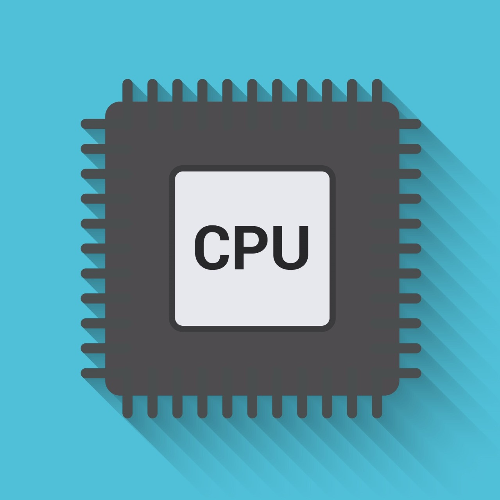

<p align="center">
  <a href="https://github.com/vivek9patel/CPU-Scheduling-APP-React-Native">
    
  </a>

  <h3 align="center">CPU Scheduling APP - Operating System</h3>

  <p align="center">
    React Native Application to visualize the CPU Scheduling with different Algorithms and Animations.
    <br />
    <a href="https://github.com/vivek9patel/CPU-Scheduling-APP-React-Native"><strong>Explore the docs »</strong></a>
    <br />
    <br />
    <a target="_blank" href="https://cpuscheduling-app.web.app/">View Demo</a>
    ·
    <a target="_blank" href="https://github.com/vivek9patel/CPU-Scheduling-APP-React-Native/issues">Report Bug</a>
    ·
    <a target="_blank" href="https://github.com/vivek9patel/CPU-Scheduling-APP-React-Native/issues">Request Feature</a>
    ·
    <a target="_blank" href="https://cpuscheduling-app.web.app/cpu_scheduling_app.apk">Install App</a>
  </p>
</p>

<!-- TABLE OF CONTENTS -->
<details open="open">
  <summary><h2 style="display: inline-block">Table of Contents</h2></summary>
  <ol>
    <li>
      <a href="#about-the-project">About The Project</a>
      <ul>
        <li><a href="#built-with">Built With</a></li>
      </ul>
    </li>
    <li>
      <a href="#getting-started">Getting Started</a>
      <ul>
        <li><a href="#prerequisites">Prerequisites</a></li>
        <li><a href="#installation">Installation</a></li>
      </ul>
    </li>
    <li><a href="#usage">Usage</a></li>
    <li><a href="#contributing">Contributing</a></li>
    <li><a href="#contact">Contact</a></li>
  </ol>
</details>

<!-- ABOUT THE PROJECT -->

## About The Project


<h4>

</h4>

### Algorithms

- FCFS Algorithm
- SJF Algorithm
- SRTF Algorithm
- Round Robin Algorithm
- LJF Algorithm
- LRTF Algorithm
- Priority Scheduling (Preemptive)
- Priority Scheduling (Non-Preemptive)

### Features

- 8 CPU Scheduling Algorithms
- Each algorithm with IO Burst
- Gannt chart
- Animation of what happens in CPU and Waiting Queue
- History Tab to store previously input data
- Haptic feedbacks

### Built With

- [React Native](https://reactnative.dev/)
- [Expo](https://expo.io/)
- [Gradle](https://gradle.org/)

<!-- GETTING STARTED -->

## Getting Started

To get a local copy up and running follow these simple steps.

### Prerequisites

Install latest npm version on your system.

- npm

  ```sh
  npm install npm@latest -g
  ```

  Check the version by running this command.

- npm version
  ```sh
  npm -v
  ```
  I used expo-cli for this project,if you want to build the project with expo install expo-cli on your system
- expo cli
  ```sh
  npm install --global expo-cli
  ```

If installation gives you error like this,

- ```sh
      npm ERR! code EACCES
      npm ERR! syscall access
      npm ERR! path /usr/local/lib/node_modules/expo-cli
      npm ERR! errno -13
      npm ERR! Error: EACCES: permission denied,...
  ```
  You have to give root permission ,like for linux:
- ```sh
    sudo npm install --global expo-cli
  ```

### Installation

1. Clone the repo
   ```sh
   git clone https://github.com/vivek9patel/CPU-Scheduling-APP-React-Native.git
   ```
2. Install Expo packages
   ```sh
   npm install expo
   ```

- Now your project folder should look like this :
  ```sh
      └── CPU-Scheduling-APP-React-Native-master
      ├── App.js
      ├── app.json
      ├── assets
      ├── babel.config.js
      ├── models
      ├── node_modules
      ├── package.json
      ├── package-lock.json
      ├── README.md
      ├── routes
      └── screens
  ```

<!-- USAGE EXAMPLES -->

## Usage

- You can run this project by starting the metro server

  ```sh
  npm start
  ```

  or

  ```sh
  expo start
  ```

- If you are using expo , you can debug the project by installing expo app on your mobile devices & scanning the QR code.

  - [Expo App Android](https://play.google.com/store/apps/details?id=host.exp.exponent&referrer=www‎)
  - [Expo App IOS](https://apps.apple.com/app/apple-store/id982107779)

- You can also debug the application by running the emulators on your systems.

<!-- CONTRIBUTING -->

## Contributing

Contributions are what make the open source community such an amazing place to be learn, inspire, and create. Any contributions you make are **greatly appreciated**.

1. Fork the Project
2. Create your Feature Branch (`git checkout -b feature/AmazingFeature`)
3. Commit your Changes (`git commit -m 'Added some AmazingFeature'`)
4. Push to the Branch (`git push origin feature/AmazingFeature`)
5. Open a Pull Request
